# Treasure Island
## Introduction

The live link can be found here - (https://treasure-island.herokuapp.com/)

Welcome to Treasure Island. Treasure Island is simple Blog but very informative blog site which gives users information about E-Commerce stores. Treasure Island blog site is about E-Commerce Store's. 

 This blog website will allow user complete CRUD system. User can register to website, user can comment on the blogs. User can add new category about E-Commerce and can add valueable information.

## Table of Contents

# Table of Contents
 [1. User Expereince (UX) design](#ux)
  - [1.1. Strategy:](#strategy)
    - [Project Goals](#project-goals)
        - [User Goals](#user-goals)
        - [User Expectation](#user-expectation)
        - [User Stories](#user-stories)
  - [1.2. Skeleton](#skeleton)

 [2. Features](#features)

 [3.Technologies used](#technologies-used)

 [4.Testing](#testing)

 [5.Bugs](#bugs)

 [6. Deployment](#deployment)
  - [6.1. Libraries](#libraries)
  - [6.2. GitHub](#github)
  - [6.3. Heroku](#heroku)

 [7. Acknowledgement](#acknowledgement)

 
# 1. User Expereince (UX) design
 [Go to top](#table-of-contents)

 This blog website will provide information to user: how many online stores are there. Which includes information regarding these stores. This website will provide information about delivery providers. How many of global delivery providers are there. How they make sure that your parcel will be dillevered safely. 
  
 It will explain about payment methods. How many ways are there to buy product online. Multiple payment are added in the blog site. if user know any he can add it.

 
 # 1.1. Strategy
  [Go to top](#table-of-contents)

 
  ### Project Goals

 The main goal of the project is to allow CRUD system to user. User can resgister to website. User can view other people blog. 
 User can login logout at any time. The Blog site is responsive and eye catching.

 
 ### User Goals:

 * User can add Blog Post
 * User can Edit Blog Post
 * User can delete Post
 * User can Comment on blog post
 * User can like Post
 * User can Add Category

 
  ### User Expectations:

  * User should be able to register to website
  * User should be able to Login/Logout to the website
  * Website should be responsive
  * User should be able to contact with the autorities

 
 ### User Stories

 Throughout the project I used the GitHub projects board to log all user stories as my project management tool. This helped me keep focus on the necesarry tasks as I would move them to the "in progress lane" as I'm working on the story. I would then move them to the "done" lane once the story has been completed.

 

 
 # 1.2. Skeleton
  [Go to top](#table-of-contents)
 
 ### Wireframes

 ### Home 
 

 ### Add Blog 
 

 ### Add Category 
 
 
 
 ### AddBlog
 
 ### AddCategory
 
 ### HomeMobile
 
 ### signIn Page 
 
 ### SignOut Page
 
 ### SignUp page
 
 
 
# 2. Features
 [Go to top](#table-of-contents)
 
 * Authentication is a key feature of the project
 * Authorization is also implemented
 * Only authorized user can add, update delete the blog or category
 * Dropdown on the category is palced so that each category can be views separatley

 ### HomePage
 Home page is designed using material design boots bootstrap. A jumbotron is placed right after the header. After the Jumbotorn a craousel is displayed which is also being designed by the material design bootstrap.

 After the craousel list of the blog is displayed. Total 6 post is being shown on the home page then a paginator is used to move items to the next page. This is a requirement by the codeinstitute. 

 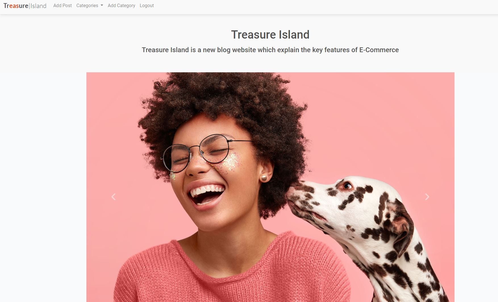
 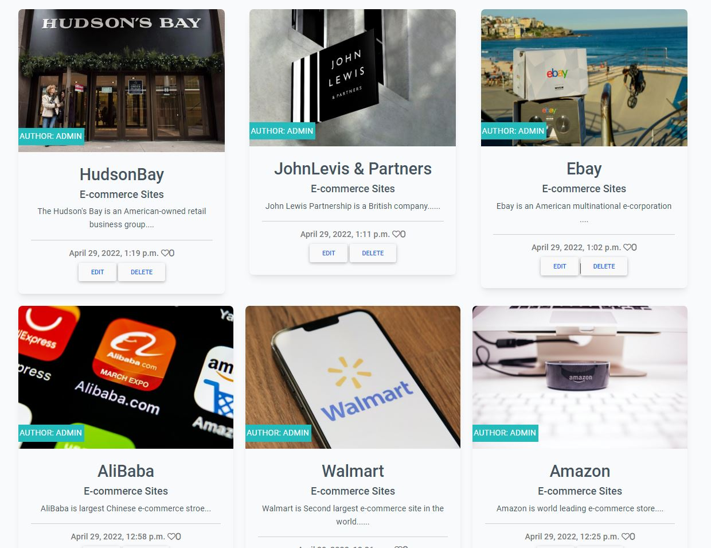

 ### Post detail

 Post detail page open when user clicked on the post. Where description of the post is being shown. On this Page user can add comments and like the post. Also delete and update button is shown so that user can update or delete the post.  

 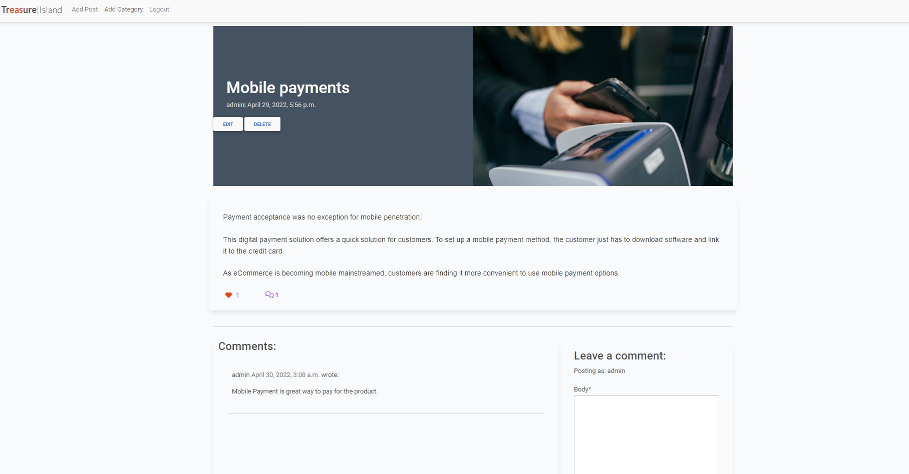

 ### Category View
  Catgegory are displayed as dropdown. multiple category are sown in the dropdown. you can click any of them to see what this category about. And You can your own category if you want and enlighten us with your knowledge.

  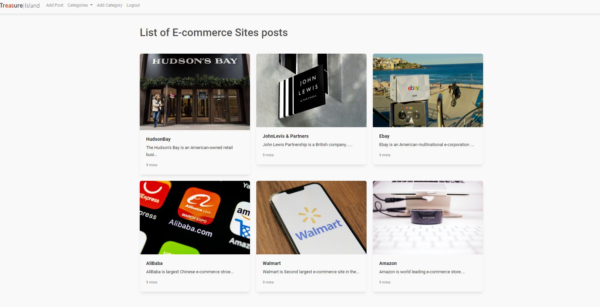
  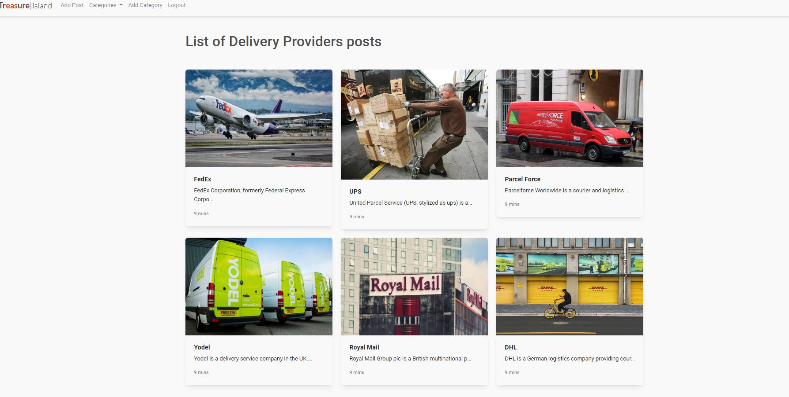
  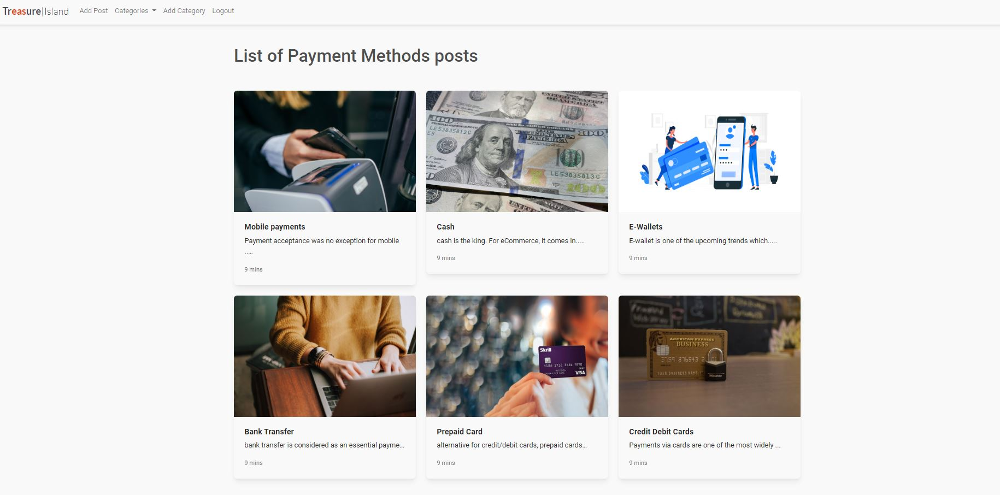

 ### Add Blog / Category

 Django class is used to render the form on page. material design bootstrap is used to beautify the page. While adding the blog user have to select the category in which category he is adding the blog.

 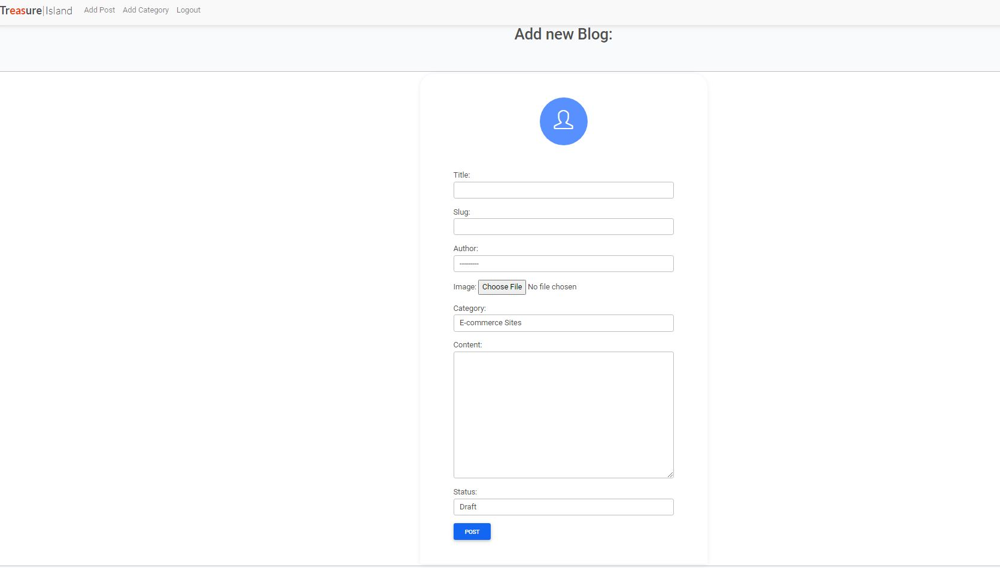
 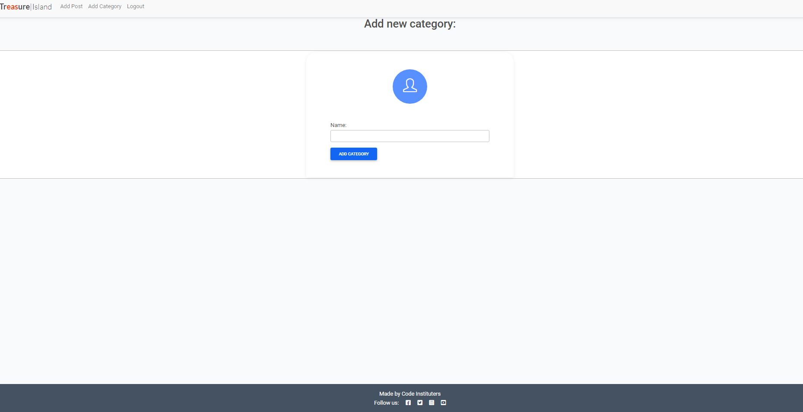

 
# 3. Technologies Used
 [Go to top](#table-of-contents)

 * Python
 * Javascript
 * HTML5
 * CSS
 * mdboostrap 4
 * Google Fonts
 * Postgresql
 * Balsamiq
 * GitHub

 
# 4. Testing
 [Go to top](#table-of-contents)

 ### Manual Checking
 
 While developing the app i have tested each and every page, url and view. I was also pylint in my editor since most the is in python. pylint gives me red or yellow lines according to the error which i solved while developing.

 During learing the course instructor told that django is MVT. If you want to create something you have to follow this procedure. So this technique help me alot to keep checking the flow. 

 On the other hand Oline tools Were also to check the code. for example in order to check html W3C was used. In order to check CSS Jigsaw was used to check PEP8 was along with pylint which was already installed in my editor.
 
 
 ## W3C
 W3C didin't help much in Check the code since python django synatxt is there.

 ## Jigsaw
 Jigsaw was used to check the css the error if there were any.

 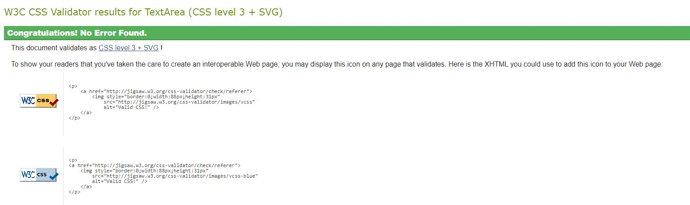

 ## PEP8
 PEP8 was used to check python code validation

 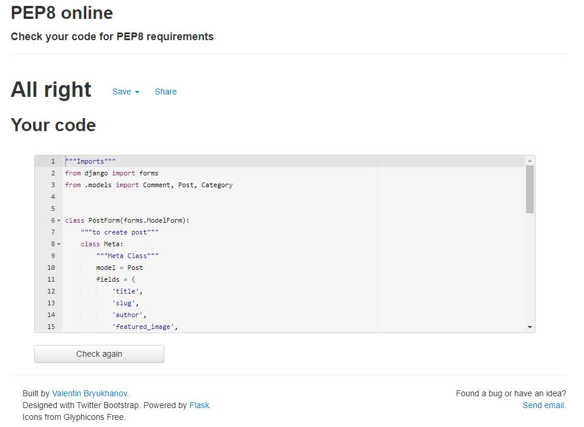
 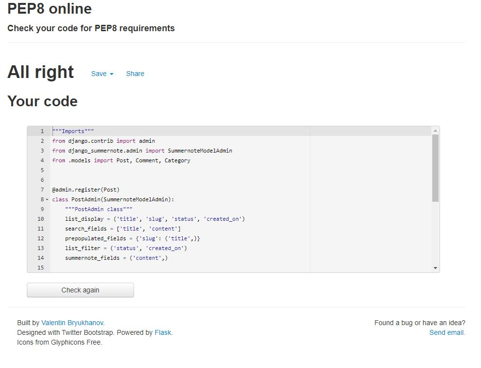

# 5. Bugs
 [Go to top](#table-of-contents)

 There is no cuurent known bugs at the moment in app.

 - on some mobile devices post detail image dosen't show

 ## 5.1 Solved Bugs

 - after installing all auth libraries i accidently put redirect urls and site ID after the Middleware section. due to this mistake i was unable to register and login.

 - so! after a lot of effort and seach online i figured it out how the redurect url have to be before middlware section. 

# 6. Deployment
 [Go to top](#table-of-contents)

 The project was deployed to GitHub and pushed throughout the devlopment process. The project was also deployed to Heroku in the early stages of development to ensure that there weren't any issues later on in the project. Mannual deploy was selected within Heroku and has been deployed the latest versio/update in the project.

 ## 6.1 Libraries
 - pip3 install django gunicorn
 - pip3 install dj_database_url psycopg2 
 - pip3 install dj3-cloudinary-storage
 - pip3 install django-summernote
 - pip3 install django-allauth

  Those are the libraries that were used in the project. 
  
  - Cloudinary was used to get/store images
  - crispy forms was used for comments

  ## 6.2 Github

  Github was used for versiona control. Code was frequently pushed to github. whenever a new library was installed requirement.txt is updated. 

  Github is further used to conenct with other cloud service to get live app.

  ## 6.3 Heroku

  Heroku was used as cloud serer which is connected through our github repository. 
  
  Heroku postgresql addons used as our database. which automaticly creates Database URL. which we use and in our env.py file and referenced it setting.py file.
  
  Then we migrate our database and create super user. we are able to access the admin panel.
  
  After finishing development code is pushed to github. Then from github we connect to heroku though heroku cli and using git push heroku command in our terminal is code is pushed to heroku and our app live.

 
# 7 Acknowledgement
 [Go to top](#table-of-contents)

 ### Code

 * The structure of the website came codestar blog app project
 * The icons in the footer and contact page came from Font Awesome
 * Thanks to my mentor Marcel Mulders for his constructive feedback.
 * Material design bootstrap was used as cdn
 * Add Blog / Blog details code taken from youtube udemy youtube.

 ### Content

 * All images came from unsplash https://unsplash.com/
 * Descripton of the item was taken from Wkikipedia
 
