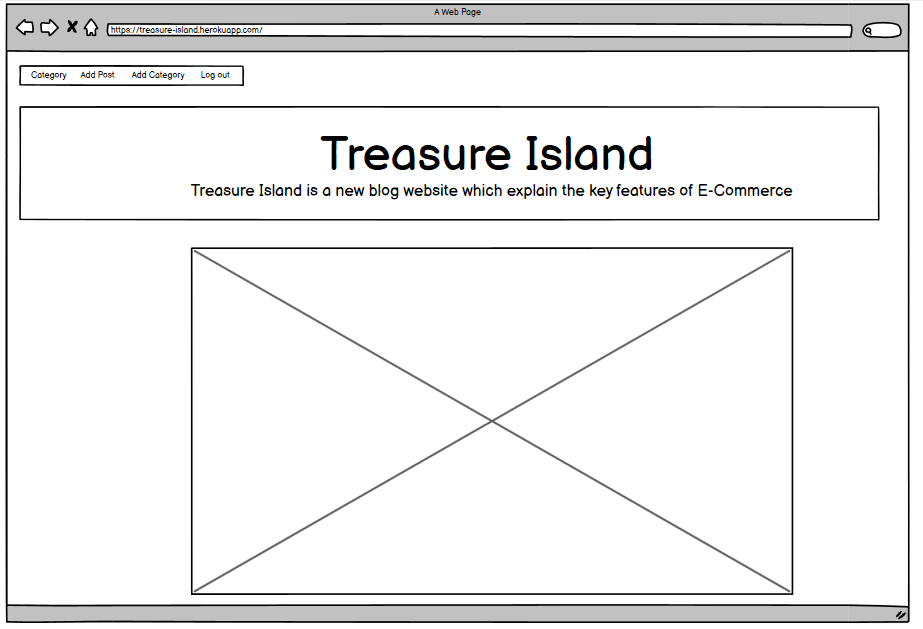

# Treasure Island
## Introduction

The live link can be found here - (https://treasure-island.herokuapp.com/)

Welcome to Treasure Island. Treasure Island is simple Blog but very informative blog site which gives users information about E-Commerce stores. Treasure Island blog site is about E-Commerce Store's. 

 This blog website will allow user complete CRUD system. User can register to website, user can comment on the blogs. User can add new category about E-Commerce and can add valueable information.

## Table of Contents

# Table of Contents
 [1. User Expereince (UX) design](#ux)
  - [1.1. Strategy:](#strategy)
    - [Project Goals](#project-goals)
        - [User Goals](#user-goals)
        - [User Expectation](#user-expectation)
        - [User Stories](#user-stories)
  - [1.2. Skeleton](#skeleton)

 [2. Features](#features)

 [3.Technologies used](#technologies-used)

 [4.Testing](#testing)

 [5.Bugs](#bugs)

 [6. Deployment](#deployment)

 [7. Acknowledgement](#acknowledgement)

 
# 1. User Expereince (UX) design
 [Go to top](#table-of-contents)

 This blog website will provide information to user: how many online stores are there. Which includes information regarding these stores. This website will provide information about delivery providers. How many of global delivery providers are there. How they make sure that your parcel will be dillevered safely. 
  
 It will explain about payment methods. How many ways are there to buy product online. Multiple payment are added in the blog site. if user know any he can add it.

 
 # 1.1. Strategy
  [Go to top](#table-of-contents)

 
  ### Project Goals

 The main goal of the project is to allow CRUD system to user. User can resgister to website. User can view other people blog. 
 User can login logout at any time. The Blog site is responsive and eye catching.

 
 ### User Goals:

 * User can add Blog Post
 * User can Edit Blog Post
 * User can delete Post
 * User can Comment on blog post
 * User can like Post
 * User can Add Category

 
  ### User Expectations:

  * User should be able to register to website
  * User should be able to Login/Logout to the website
  * Website should be responsive
  * User should be able to contact with the autorities

 
 ### User Stories

 Throughout the project I used the GitHub projects board to log all user stories as my project management tool. This helped me keep focus on the necesarry tasks as I would move them to the "in progress lane" as I'm working on the story. I would then move them to the "done" lane once the story has been completed.

 

 
 # 1.2. Skeleton
  [Go to top](#table-of-contents)
 
 ### Wireframes

 ### Home 
 

 ### Add Blog 
 

 ### Add Category 
 
 
 
 ### AddBlog
 
 ### AddCategory
 
 ### HomeMobile
 
 ### signIn Page 
 
 ### SignOut Page
 
 ### SignUp page
 
 
 
# 2. Features
 [Go to top](#table-of-contents)
 
 * Authentication is a key feature of the project
 * Authorization is also implemented
 * Only authorized user can add, update delete the blog or category
 * Dropdown on the category is palced so that each category can be views separatley

 ### HomePage
    Home page is designed using material design boots bootstrap. A jumbotron is placed right after the header. After the Jumbotorn a craousel is displayed which is also being designed by the material design bootstrap.

    After the craousel list of the blog is displayed. Total 6 post is being shown on the home page then a paginator is used to move items to the next page. This is a requirement by the codeinstitute. 

 
 

 ### Post detail

 Post detail page is shown 